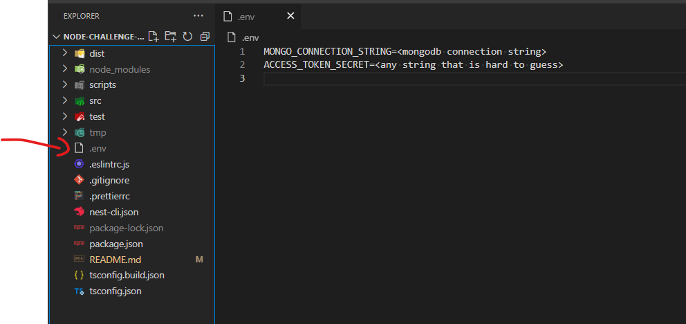
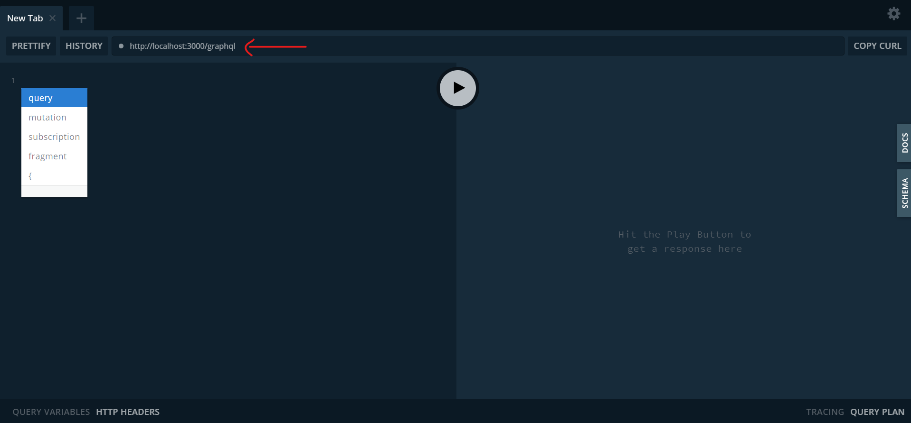

# node challenge assignment

ontwik node challenge assignment to be reviewed, it contains a Graphql API that represents an employees management system, where each employer can add, update and delete employees.

It's a Nest.js project with GraphQl API, connecting to a Mongodb database.

## installation

```bash
npm install
```

## Running the app

```bash
# development
$ npm run start

# watch mode
$ npm run start:dev

# production mode
$ npm run start:prod
```

but before running the program, it must be a "*.env*" file in the root directory containing the following environment variables

    MONGO_CONNECTION_STRING

    ACCESS_TOKEN_SECRET

example:



---------

after running, visit **/graphql** path, you'll start a Graphql playground to start experimenting with the api.





## seeding the database


to seed users (employers) and employees tap :
```bash
ts-node scripts/seed.ts
```
to clear users (employers) and employees :
```bash
ts-node scripts/seed.ts --clear
```
tap
```bash
ts-node scripts/seed.ts -h
```
for more info.

